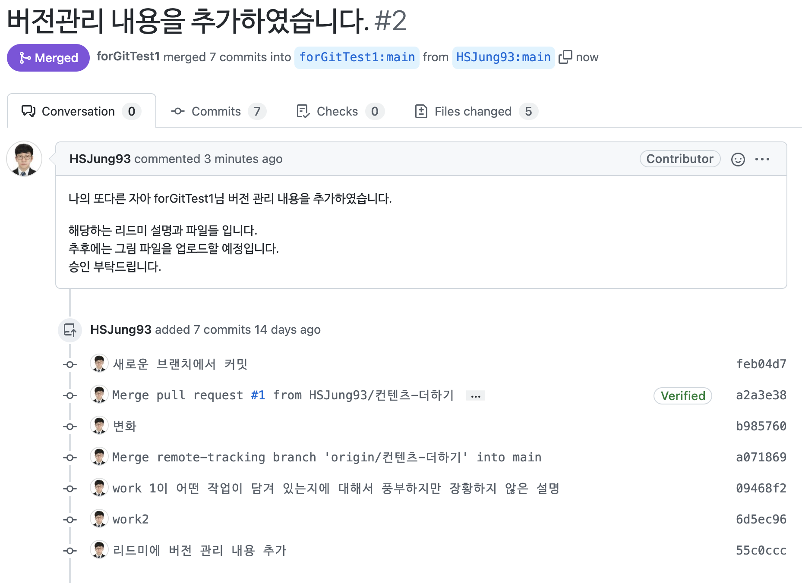

# -Git-forGitTest

면접 전에 git을 통한 협업을 체크해보기 위한 레포

## fork 와 pull request

1. forTestGit1 으로 저장소를 하나 만든다.
2. HSJung93으로 fork 해온다
3. local로 clone한 뒤 README.md 작성 및 test.html 작성

## 버전관리

1. work1.txt를 만들고 커밋.
2. 이 버전을 HEAD에 기록하는데, HEAD가 main을 가리키기 때문에 main에 기록한다. main은 40자 commit id(즉 현재 버전!)를 가리키는 중이다.
3. work2와 3을 두번째 버전으로 커밋. 하면 HEAD -> main -> 두번째 버전(커밋 아이디)이 된다. 근데 새로운 커밋 아이디는 이전 커밋 아이디를 가리키며, 이전 커밋 아이디에 대한 정보를 망라하여 만들어진다.
4. 시간여행: 과거의 버전으로 돌아가고 싶으면 HEAD를 해당 커밋아이디로 `checkout` 명령어로 이동시키면 된다. 그러면 깃 내부적으로는
   1. 커밋 아이디에 해당하는 파일의 이름과 내용을 stage에 올리고 working 디렉토리도 변경한다.
   2. 그 후 HEAD의 값이 과거 커밋 아이디가 된다.
5. 과거 버전으로 돌아가면 기존 `git log`로는 미래 버전이 보이지 않으니 `git log --all`로 HEAD의 부모 뿐 아니라 main의 부모도 볼 수 있다.
   1. main은 해당 브랜치에서 작업한 마지막 작업을 가리킨다.
6. 다시 미래로 `git check main` 혹은 `git checkout 해당_커밋_아이디`로 돌아갈 수 있다.
   1. 해당 커밋 아이디로 돌아가면 Detached HEAD 상태가 된다.
   2. Attached HEAD 상태는 HEAD > 브랜치 > 특정 커밋을 가리키는 상태인데, Detached HEAD에서는 HEAD > 특정 커밋을 가리킨다.
   3. 작업 중 Detached HEAD에서 다른 브랜치로 체크아웃하면, 이전 커밋 아이디를 모를 시에 돌아가기 난감한 상황이 발생할 수 있다. (기본적으로 그래프에도 표시되지 않는다.)
   4. `git reflog` 명령어로 히스토리를 통하여 이전 커밋 아이디를 찾아 다시 돌아갈 수 있다.
   5. 깃은 기본적으로 브랜치를 통하여 커밋을 관리하기 때문에 해프닝이 발생할 수 있다. Detached HEAD에서는 `git checkout -b 브랜치_이름` 으로 브랜치를 만들고 커밋을 살리는 방법을 깃에서는 권장한다.

## Pull Request 및 Merge

1. HSJung93은 forGitTest1의 -Git-forGitTest를 fork해서 코드를 수정하였다.
2. HSJung93은 이제 fork 해서 만든 -Git-forGitTest 레포지토리에서 New pull Request를 한다.
   
3. forGitTest1의 -Git-forGitTest로 가서 pull Request를 승인하고 merge 한다.
   
4. 완료! (리드미에 이미지 파일을 업로드한 수정 사항은 추후에 pull request를 할 것이다.)
   
